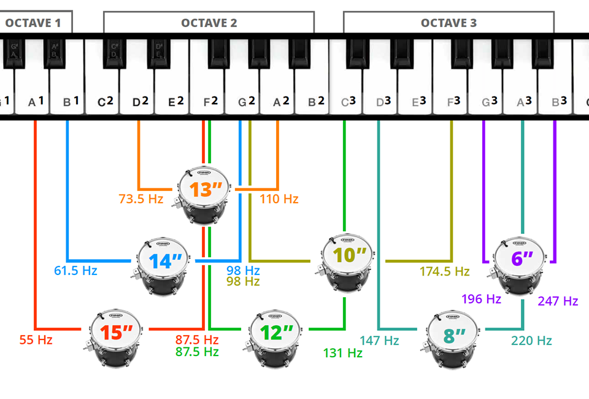
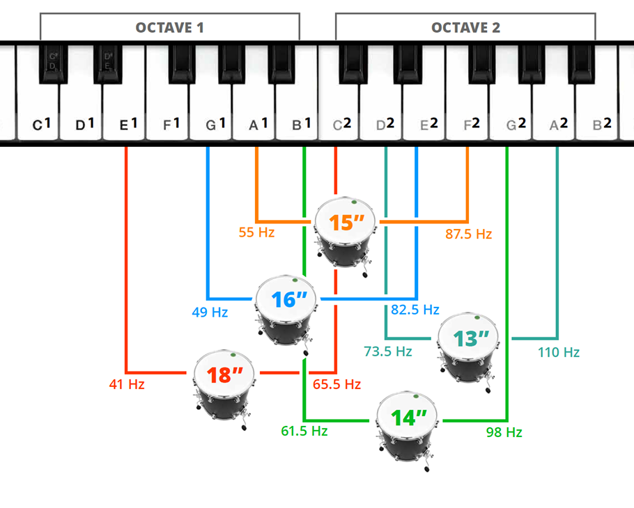
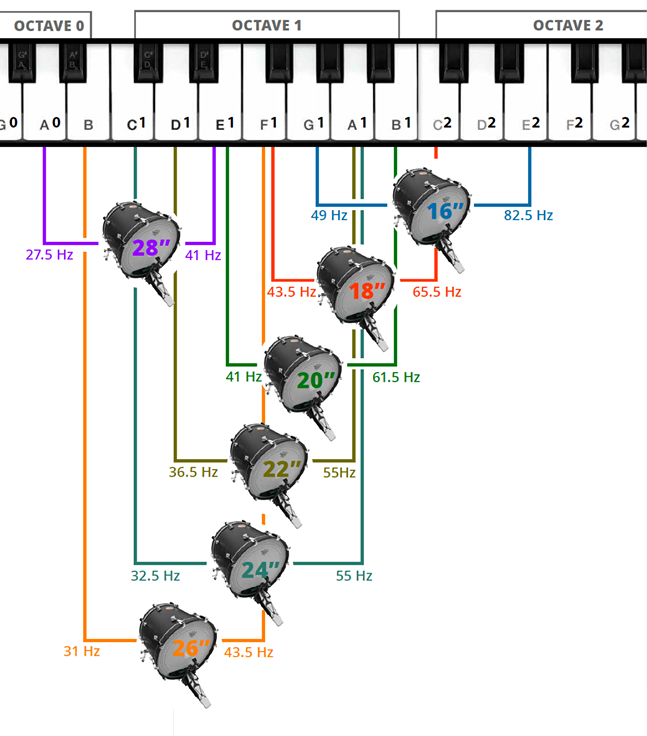
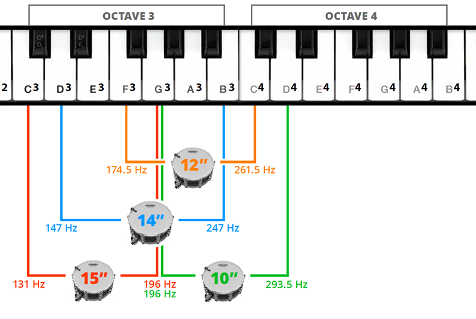

# Tuning Ranges

## Tom

|     | F2  | Gb2 | G2  | Ab2 | A2  | Bb2 | B2  | C3  | Db3 | D3  | Eb3 | E3  | F3  | Gb3 | G3  | Ab3 | A3  |
| --- | --- | --- | --- | --- | --- | --- | --- | --- | --- | --- | --- | --- | --- | --- | --- | --- | --- |
| 8"  |     |     |     |     |     |     |     |     |     | 3-  | 2-  | 1-  | 0   | 0   | 1+  | 2+  | 3+  |
| 10" |     |     | 5-  | 4-  | 3-  | 2-  | 1-  | 0   | 1+  | 2+  | 3+  | 4+  | 5+  |     |     |     |     |
| 12" | 3-  | 2-  | 1-  | 0   | 0   | 1+  | 2+  | 3+  |     |     |     |     |     |     |     |     |     |

## Floortom

|     | G1  | Ab1 | A1  | Bb1 | B1  | C2  | Db2 | D2  | Eb2 | E2  | F2  | Gb2 | G2  | Ab2 | A2  | Bb2 | B2  |
| --- | --- | --- | --- | --- | --- | --- | --- | --- | --- | --- | --- | --- | --- | --- | --- | --- | --- |
| 14" |     |     |     |     | 4-  | 3-  | 2-  | 1-  | 0   | 1+  | 2+  | 3+  | 4+  |     |     |     |     |
| 15" |     |     | 4-  | 3-  | 2-  | 1-  | 0   | 1+  | 2+  | 3+  | 4+  |     |     |     |     |     |     |
| 16" | 4-  | 3-  | 2-  | 1-  | 0   | 0   | 1+  | 2+  | 3+  | 4+  |     |     |     |     |     |     |     |

## Kick 

## Snare

# Toms
## Vinnie, Dave,...

With four toms, the toms are tuned in fourths an fiths (B - E (4th) and E - B (5th))

A general rule that works for almost ny kit, single or double ply batter, most versatile sound for studio use this:
reso head a minor third higher than the batter head.

Tons of drummer use it.

If you want a specific note as fundamental, go down a semitone for the batter and three more for the resonant (harmonic on higher octave).
Might want to raise a bit the resonant for bigger toms and losen ist up for smaller ones, depending on the shell depth.

Fundamental intervall: __perfect 4th__ (B - E) __perfect 5th__ (E - B) 

Batter to Reso intervall: __minor 3rd__

| Tom Size | Fundamental | Batter Lug  | Reso Lug    |
| -------- | ----------- | ----------- | ----------- |
|  10" (4+)| E     164Hz | C     262Hz | Eb    311Hz |
|  12" (2+)| B     124Hz | G     196Hz | Bb    233Hz |
|  14" (1+)| E      82Hz | C     131Hz | Eb    158Hz |
|  16" (0 )| B      62Hz | G      98Hz | Bb    118Hz |

| Tom Size | Fundamental | Batter Lug  | Reso Lug    |
| -------- | ----------- | ----------- | ----------- |
|  10" (2+)| D     146Hz |      231Hz* |      277Hz* |
|  12" (0 )| A     110Hz |      173Hz* |      208Hz* |
|  14" (1-)| D      73Hz |      116Hz* |      139Hz* |
|  16" (2-)| A      55Hz |       87Hz* |      104Hz* |

\* values may be slightly too _low_

# Toms
## Major 3rd
### Studio

Fundamental intervall: __major 3rd__

Batter to Reso intervall: __minor 3rd__

| Tom Size | Fundamental | Batter Lug  | Reso Lug    |
| -------- | ----------- | ----------- | ----------- |
|  10" (2+)| D     146Hz | Bb   231Hz* | Db    277Hz |
|  12" (1+)| Bb    110Hz | Gb   184Hz* | A     220Hz |
|  14" (3+)| Gb     92Hz | D    146Hz* | F     175Hz |
|  16" (2+)| D      73Hz | Bb   116Hz* | Db    139Hz |

\*values might be slightly too _low_

\* Yamaha Maple Custom Absolute

| Tom Size | Fundamental | Batter Lug  | Reso Lug    |
| -------- | ----------- | ----------- | ----------- |
|  10" (1-)| B     124Hz |       194Hz |       233Hz |
|  12" (1-)| G      98Hz |       154Hz |       185Hz |
|  14" (0 )| Eb     78Hz |       123Hz |       147Hz |
|  16" (0 )| B      62Hz |        97Hz |       117Hz |

### Low resonace

Fundamental intervall: __major 3rd__

Batter to Reso intervall: __perfect 4th__

| Tom Size | Fundamental | Batter Lug  | Reso Lug    |
| -------- | ----------- | ----------- | ----------- |
|  10" (2+)| D     146Hz |       220Hz |       290Hz |
|  12" (1+)| Bb    116Hz |       175Hz |       230Hz |
|  14" (3+)| Gb     92Hz |       139Hz |       182Hz |
|  16" (2+)| D      73Hz |       110Hz |       145Hz |

\* Yamaha Maple Custom Absolute (10" 12" 14" 16")

| Tom Size | Fundamental | Batter Lug  | Reso Lug    |
| -------- | ----------- | ----------- | ----------- |
|  10" (1-)| B     124Hz |       183Hz |       244Hz |
|  12" (1-)| G      98Hz |       146Hz |       194Hz |
|  14" (0 )| Eb     78Hz |       116Hz |       154Hz |
|  16" (0 )| B      62Hz |        92Hz |       123Hz |

## Perfect 4th
### Studio

Fundamental intervall: __perfect 4th__

Batter to Reso intervall: __minor 3rd__

| Tom Size | Fundamental | Batter Lug  | Reso Lug    |
| -------- | ----------- | ----------- | ----------- |
|  10" (4+)| E     164Hz |       259Hz |       311Hz |
|  12" (2+)| B     124Hz |       194Hz |       233Hz |
|  14" (3+)| Gb     92Hz |       146Hz |       175Hz |
|  16" (1+)| Db     69Hz |       109Hz |       131Hz |

| Tom Size | Fundamental | Batter Lug  | Reso Lug    |
| -------- | ----------- | ----------- | ----------- |
|  10" (2+)| D     146Hz |       233Hz |       277Hz |
|  12" (0 )| A     110Hz |       175Hz |       208Hz |
|  14" (1+)| E      82Hz |       131Hz |       158Hz |
|  16" (0 )| B      62Hz |        98Hz |       118Hz |

| Tom Size | Fundamental | Batter Lug  | Reso Lug    |
| -------- | ----------- | ----------- | ----------- |
|  10" (0 )| C     130Hz |       206Hz |       247Hz |
|  12" (1-)| G      98Hz |       156Hz |       185Hz |
|  14" (1-)| D      74Hz |       116Hz |       139Hz |
|  16" (2-)| A      55Hz |        87Hz |       104Hz |

### Low resonace

Fundamental intervall: __perfect 4th__

Batter to Reso intervall: __perfect 4th__

| Tom Size | Fundamental | Batter Lug  | Reso Lug    |
| -------- | ----------- | ----------- | ----------- |
|  10" (2+)| D     146Hz |       218Hz |       291Hz |
|  12" (0 )| A     110Hz |       163Hz |       218Hz |
|  14" (1+)| E      82Hz |       122Hz |       163Hz |
|  16" (0 )| B      62Hz |        92Hz |       122Hz |

\* Tama Starclassic (10" 12" 14")

| Tom Size | Fundamental | Batter Lug  | Reso Lug    |
| -------- | ----------- | ----------- | ----------- |
|  10" (0 )| C     130Hz |       194Hz |       259Hz |
|  12" (1-)| G      98Hz |       146Hz |       194Hz |
|  14" (1-)| D      74Hz |       109Hz |       145Hz |
|  16" (2-)| A      55Hz |        82Hz |       109Hz |

# Bass Drum

Batter to Reso intervall: __perfect 5th__

| Size        | Fundamental | Batter Lug  | Reso Lug    |
| ------------| ----------- | ----------- | ----------- |
| 20"         | F      43Hz |        61Hz |        91Hz |
| 20" - 22"   | E      41Hz |        57Hz |        86Hz |
| 22"         | Eb     39Hz |        54Hz |        81Hz |
| 22" - 24"   | D      37Hz |        51Hz |        76Hz |

